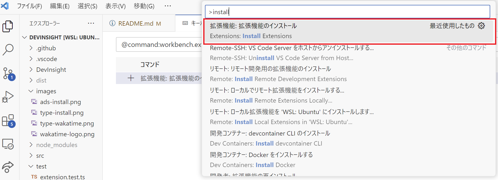
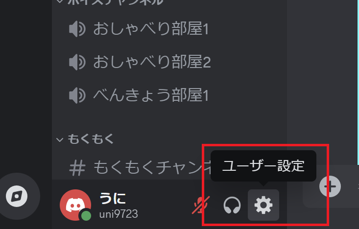
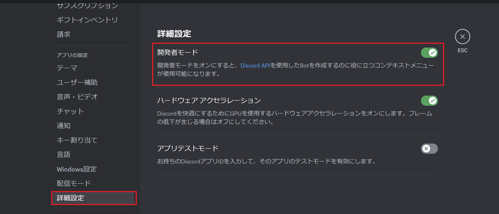
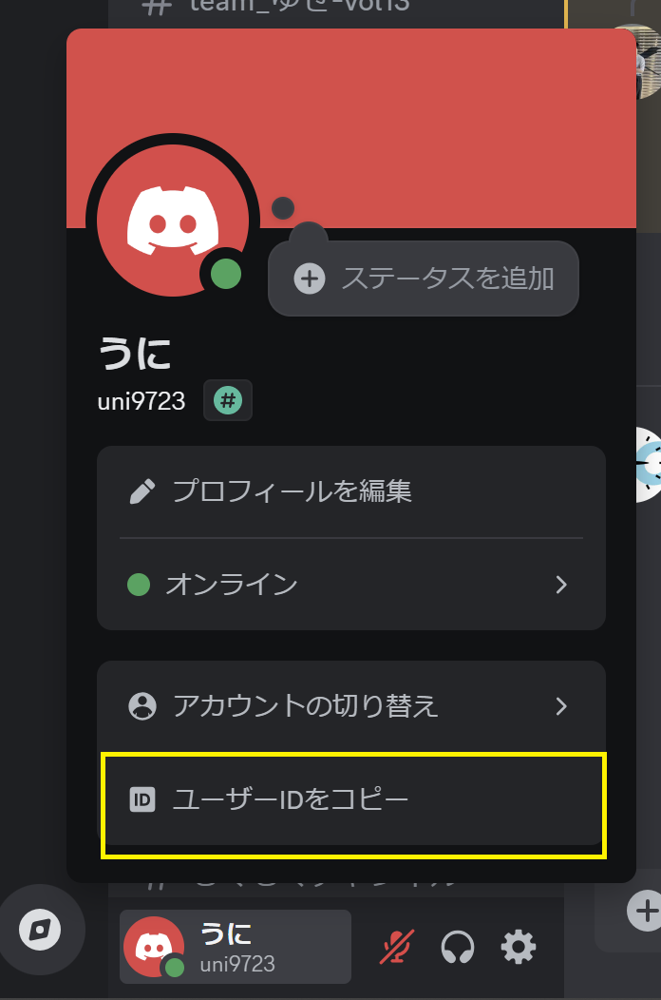

# DevInsights for Visual Studio Code

[DevInsights] は、Visual Studio Code でのコーディングに費やした時間を自動的に追跡し、生産性に関する詳細な洞察を提供するツールです。また、Discord と統合されており、総コーディング時間をランキング表示することで、どのユーザーが最も作業したかを確認できます。さらに、DevInsights は複数の IDE やエディタと連携できるため、さまざまなプラットフォームでのコーディング活動を包括的に把握できます。

## インストール

1. F1 キーまたは ⌘ + Shift + P を押して「install」と入力します。次に「Extensions: Install Extension」を選択します。

2. 「devinsights」と入力し、Enter キーを押します。

3. Discord ID を入力し、Enter キーを押します。
   （プロンプトが表示されない場合は、F1 キーまたは ⌘ + Shift + P を押して「DevInsights Discord ID」と入力してください。）

   **Discord ID のコピー方法:**
   - Discord を開き、ユーザー設定に移動します。
   
   - 「詳細設定」の下で「開発者モード」を有効にします。
   
   - ユーザーリスト内のユーザー名またはプロフィールを右クリックし、「ID をコピー」を選択します。
   

4. VS Code を使用すると、コーディング活動が毎週ランキングされます。

## 使用方法

毎週、Discord ボットがユーザーをコーディングに費やした時間に基づいてランク付けし、コーディング活動のリーダーボードを提供します。

## 設定

**VS Code の設定:**
⌘ + Shift + P を押して「DevInsights: Input Discord Id」と入力し、Discord ID を設定します。